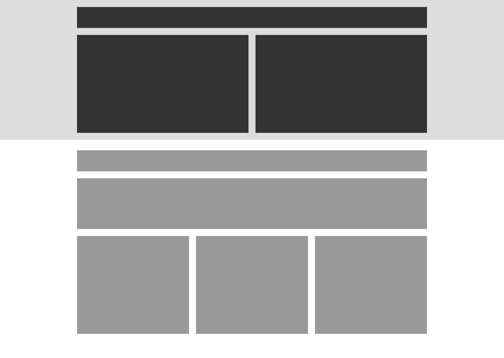

### Web design challege

#### 1 - Add a grid for desktop
 

Trying to replicate the above layout using HTLM and CSS.

Requirements:
- Your code is practically pixel perfect compared to the design provided.
- Everything, other than the lightest grey box, should be a fixed width.
- All your styling is in a separate file to the html.

Notes:

I've included two style sheets.
The first 'style.css' I feel is a more accurate more scalable version of the template.

The second 'style2.css' (which I will be hosting with) is more specifyed to the design requirements, all but one container has a fixed width.

Hosted [here](http://prickly-desk.surge.sh/)
